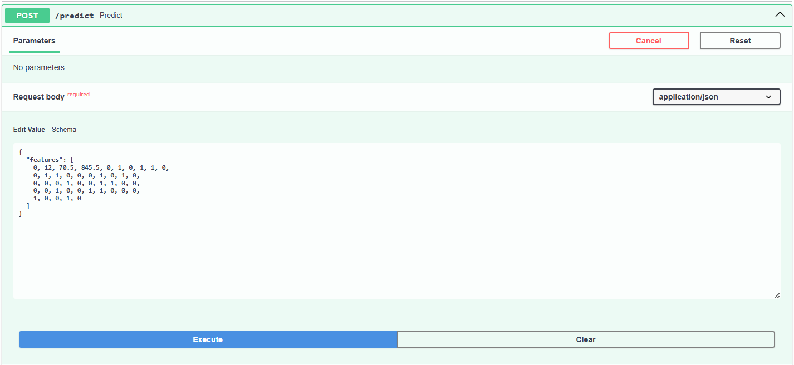
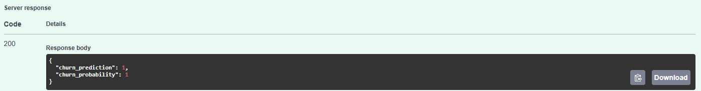

# 📊 Customer Churn Prediction API

A production-ready Machine Learning API that predicts whether a telecom customer will churn.  
Built with **FastAPI**, trained using **Logistic Regression** on the Telco Customer Churn dataset.

---

## 🚀 Features

- ✅ Predict churn based on 45 encoded input features
- ✅ Trained on real-world telecom data
- ✅ Deployed with FastAPI
- ✅ Supports cloud deployment (Render, EC2)
- ✅ Clean and scalable codebase

---

## 🧠 ML Model Summary

- **Dataset**: [Telco Customer Churn (Kaggle)](https://www.kaggle.com/datasets/blastchar/telco-customer-churn)
- **Models Tested**:
  - `Logistic Regression` ✅ (Selected — best balance of performance & interpretability)
  - `XGBoost` (slightly higher ROC AUC but longer training + complexity)
  - `Random Forest` (good F1, but overfitted slightly on small data)
- **Final Model**: Logistic Regression
- **Evaluation**:
  - F1 Score: `0.76`
  - ROC AUC: `0.84`

---

## 📦 Tech Stack

- **Modeling**: scikit-learn, XGBoost
- **Serving**: FastAPI + Uvicorn
- **Language**: Python 3
- **Deployment**: Ready for Render, Docker, or EC2

---

## 📬 API Usage

### 🔗 Endpoint

```bash
POST /predict
```

### ✅ Input JSON (45 features, one-hot encoded, in model order):

```json
{
  "features": [0, 12, 70.5, 845.5, 0, 1, 0, 1, 1, 0, ..., 1, 0]
}
```


<details>
  <summary>📥 Input Feature Order (click to expand)</summary>

1. SeniorCitizen
2. tenure
3. MonthlyCharges
4. TotalCharges
5. gender_Female
6. gender_Male
7. Partner_No
8. Partner_Yes
9. Dependents_No
10. Dependents_Yes
11. PhoneService_No
12. PhoneService_Yes
13. MultipleLines_No
14. MultipleLines_No phone service
15. MultipleLines_Yes
16. InternetService_DSL
17. InternetService_Fiber optic
18. InternetService_No
19. OnlineSecurity_No
20. OnlineSecurity_No internet service
21. OnlineSecurity_Yes
22. OnlineBackup_No
23. OnlineBackup_No internet service
24. OnlineBackup_Yes
25. DeviceProtection_No
26. DeviceProtection_No internet service
27. DeviceProtection_Yes
28. TechSupport_No
29. TechSupport_No internet service
30. TechSupport_Yes
31. StreamingTV_No
32. StreamingTV_No internet service
33. StreamingTV_Yes
34. StreamingMovies_No
35. StreamingMovies_No internet service
36. StreamingMovies_Yes
37. Contract_Month-to-month
38. Contract_One year
39. Contract_Two year
40. PaperlessBilling_No
41. PaperlessBilling_Yes
42. PaymentMethod_Bank transfer (automatic)
43. PaymentMethod_Credit card (automatic)
44. PaymentMethod_Electronic check
45. PaymentMethod_Mailed check

</details>

### 📤 Output:

```json
{
  "churn_prediction": 1,
  "churn_probability": 0.8427
}
```

---

## 🛠 Local Setup

```bash
# 1. Install dependencies
pip install -r requirements.txt

# 2. Run FastAPI server
uvicorn app.main:app --reload
```

Visit `http://localhost:8000/docs` for Swagger UI to test the API.

---

## 🌍 Live Demo

**URL:** [https://churn-prediction-mqv6.onrender.com/docs]  

---

## 🧪 Example cURL Test

```bash
curl -X 'POST' \
  'http://localhost:8000/predict' \
  -H 'Content-Type: application/json' \
  -d '{ "features": [0, 12, 70.5, 845.5, 0, 1, 0, 1, 1, 0, ..., 1, 0] }'
```

---

## 📁 Project Structure

```
churn-api/
├── app/
│   └── main.py              # FastAPI app
├── model/
│   └── churn_model.pkl      # Trained model
├── requirements.txt
└── README.md
```

---

### 🖼️ Demo Screenshots

**Swagger UI**


**Sample Prediction Output**


---

## 📌 Author
[https://github.com/chandanabhargav]